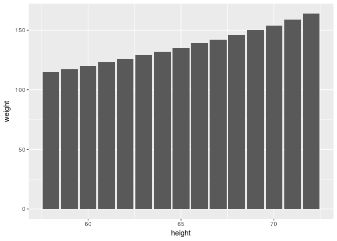
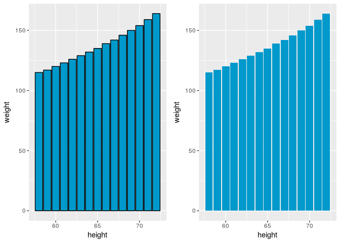
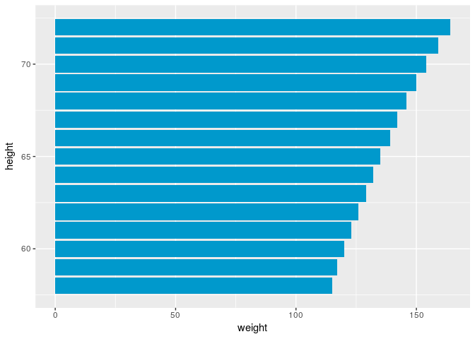

geom\_bar wykres słupkowy
================
KW
2017-10-03

Hej! Zanim rozpoczniemy przygodę z ggplot potrzebujemy wczytac bilbioteki i dane na których będziemy pracować.

``` r
library(ggplot2)
library(datasets)
```

z pakietu datasets wybieram dane 'women' pokazujące wysokość i wagę kobiet w wieku 30-39 lat.

``` r
datasets::women
```

    ##    height weight
    ## 1      58    115
    ## 2      59    117
    ## 3      60    120
    ## 4      61    123
    ## 5      62    126
    ## 6      63    129
    ## 7      64    132
    ## 8      65    135
    ## 9      66    139
    ## 10     67    142
    ## 11     68    146
    ## 12     69    150
    ## 13     70    154
    ## 14     71    159
    ## 15     72    164

Pierwszy wykres!
----------------

``` r
ggplot(data = women, aes(x = height, y = weight)) + # aes określa m.in. osie x i y, co i gdzie ma się rysować
  geom_bar(stat = 'identity') # określenie rodzaju wykresu. w tym przypadku jest to wykres słupkowy
```

 Argument *stat* wskazuje w jakiej postaci mamy dane. *'identity'* znaczy, że podane dane są już odpowiednio przygotowane do plotowania. \[domyślnie stat = 'count'\]

Argumenty aes() można również przypisywać za każdym razem w funkcji geom\_...(). Argumenami geom\_bar() mogą być m.in. kolor i wypełnienie.

``` r
a <- ggplot(data = women, aes(x = height, y = weight)) +
  geom_bar(color = 'black', # obwoluta słupków
           fill = '#0099cc',  # wypełnienie słupków 
           stat = 'identity') 
b <- ggplot(data = women, aes(x = height, y = weight)) +
  geom_bar(fill = '#0099cc',  # samo wypełnienie słupków 
           stat = 'identity') 
gridExtra::grid.arrange(a, b , ncol = 2)
```



wykres słupkowy poziomy
-----------------------

``` r
b +
  coord_flip()
```


