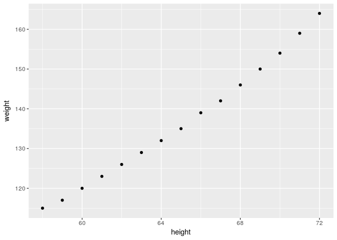
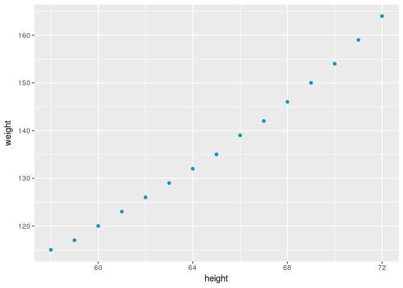
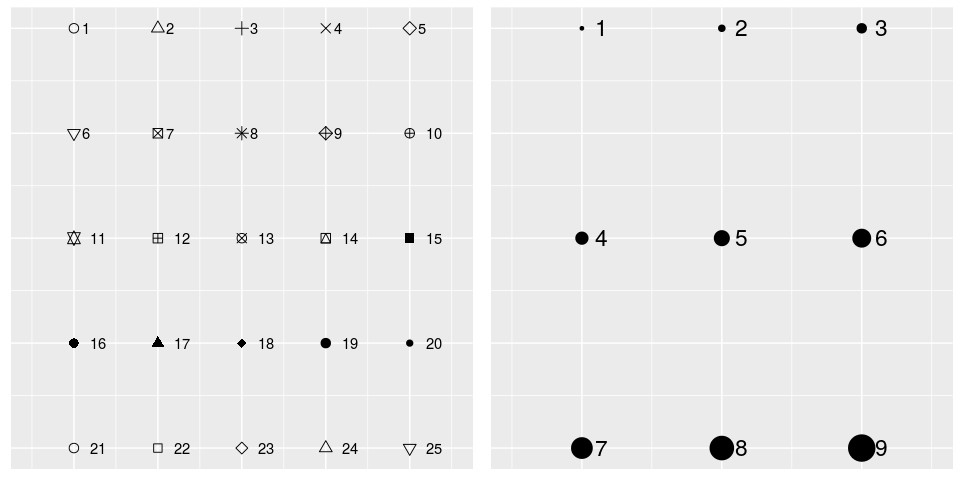
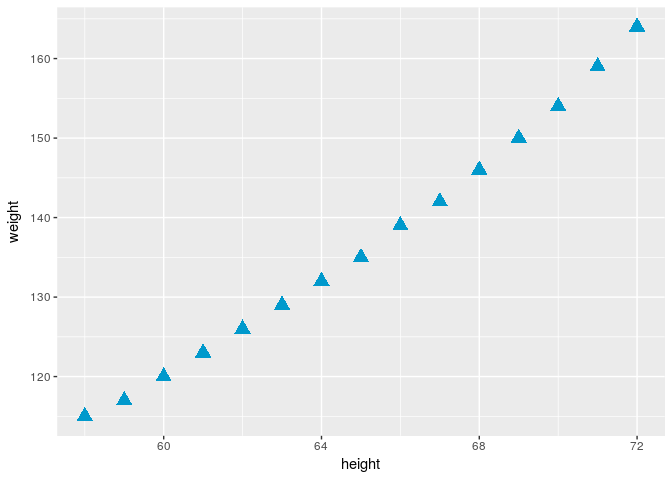

geom\_point Wykres punktowy
================
KW
2017-10-03

Wykres punktowy jest jeszcze prostszy od wykresu słupkowego.

``` r
library(ggplot2)
library(datasets)
```

Początek jest zawsze ten sam: ggplot() Funkcja która rysuje kropki na wykresie to geom\_point()

``` r
ggplot(data = women,
       aes(x = height, y = weight)) +
         geom_point()
```



Dodatkowymi argumentami geom\_point mogą być: *kształt, kolor, wielkość*.

Kolor
-----

``` r
ggplot(data = women,
       aes(x = height, y = weight)) +
         geom_point(color = '#0099CC')
```



Rodzaje punktorów i wielkość
----------------------------



``` r
ggplot(data = women,
       aes(x = height, y = weight)) +
  geom_point(shape = 17, color = '#0099CC', size = 4)
```


